# Classifying cardiomyopathy v. coronary artery disease for patients with and without vectorized text data

### Author contributions available [here](contributions.md)

## Abstract

Cardiomyopathy and coronary artery disease (CAD) are associated with correlated symptoms and other physiologic measures and both lead to the same downstream effects, namely heart failure, thereby making it difficult to distinguish between the two. Differentiation between cardiomyopathy and CAD is therefore important because treatment for each disease is different. However, there are no appropriate predictive algorithms for classifying cardiomyopathy and CAD for patients yet. Here we use Doc2Vec and an ensemble of machine learning classification approaches to better address the differentiation problem using both text data and non-text data. The aim of this project is to develop a predictive algorithm to differentiate between cardiomyopathy and CAD patients. Diagnosis can be completed through invasive testing like angiograms, so opportunities to predict differentiation without the use of invasive procedures may lead to better patient outcomes and decreased hospital costs.

## Introduction and Background

Heart failure is a condition in which the heart cannot provide enough blood flow to meet the body's demand for oxygenated blood during regular activity, or when pressure within the heart rises. Heart failure is not a single disease, but a chronic and progressive condition that can be the ultimate common pathway for several structural or functional heart diseases that impair the ability to fill or empty the heart [1,2]. Heart failure can occur when the heart muscle is weak which is called systolic failure or when it is stiff and cannot relax normally which is called diastolic failure. 

Heart failure caused by weakened pumping strength occurs with a left ventricular ejection fraction (EF) less than 40 percent [3]. Heart failure with low EF is associated with enlargement of the heart, which is the most common type of heart failure in patients younger than age 65 [3]. Cardiomyopathy and CAD are the main causes of this heart failure type [2,3]. Cardiomyopathy is a disorder which affects cardiac muscle, making systemic circulation difficult [1,3]. It is one of the main causes of heart failure in all age groups and sudden cardiac death in young people [1,4]. Mortality of cardiomyopathy patients is 3.4% according to the 2020 JAMA cardiology report [5]. While cardiomyopathy is a disease of the heart muscle [3,6], CAD is a failure of the blood vessels [7]. CAD causes irreversible damage to the heart muscle and failures in systemic circulation [3,6]. 

Heart failure is a continuing public health problem in the United States. The prevalence of heart failure in the adult population over the age of 20 is 2.6% [2,3]. In the United States, about 5.8 million people suffer from heart failure, with over 1 million hospitalizations each year, and 12 to 15 million patients annually visiting treating doctors [8]. Even though accurate diagnosis is important to properly treat patients with symptoms due to heart failure, the current diagnosis methods such as echocardiography, nuclear imaging tests or magnetic resonance imaging (MRI) can lead to confusion due to similar symptoms in different causes of heart failure. For example, cardiomyopathy and CAD that are the main causes of heart failure have indistinguishable symptoms such as fatigue, breathlessness, chest pain or dizziness [9,10]. However, different strategies of treatments are required for either cardiomyopathy or CAD. The treatments for cardiomyopathy should focus on the recovery of the heart muscle, and for CAD treatment, the clogged arteries should be opened to allow good blood flow [9,11,12]. 

Therefore, it is important to predict differentiation between cardiomyopathy and CAD without the use of invasive procedures, but there are no appropriate predictive algorithms for classifying cardiomyopathy and CAD for patients yet. In this project, we aim to develop a predictive algorithm to differentiate between cardiomyopathy and CAD patients to improve diagnostic accuracy and reduce the need for invasive diagnostic procedures. 

## Methods

### Workflow Schematic

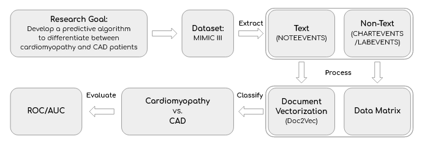

### Data Source

We used the Medical Information Mart for Intensive Care III (MIMIC-III) dataset from Massachusetts Institute of Technology (MIT) Lab for Computational Physiology. The dataset contains 11 years of de-identified health records from Intensive Care Unit patients. It features lab results, doctor notes, diagnoses, medicines, and more. We used ```NOTEEVENTS```, ```D_ICD_Diagnoses```, ```DIAGNOSES_ICD```, ```CHARTEVENTS```, ```LABEVENTS```, ```D_ITEMS``` and  ```D_LABITEMS``` tables from MIMIC-III data source.


### Data Extraction and Processing

#### ICD-9 Codes

This work is performed in [SubID_ICD_Diseases.ipynb](https://github.com/a-ram-1/cbb-750-final/blob/master/SubID_ICD_Diseases.ipynb). We used the ```D_ICD_Diagnoses``` table from MIMIC III to find the ICD-9 codes associated with the diseases we are interested in which are Cardiomyopathy and CAD. First, we obtained data only related to 'Cardiomyopathy' by sorting the rows containing 'cardiomyopath' in the ```LONG_TITLE``` column in the data frame because cardiomyopathy disease describes '<ins>cardiomyopathy</ins>' or '<ins>cardiomyopathies</ins>'. Second, we also obtained data only related to 'CAD' by sorting the rows containing 'atherosclerosis' in the ```LONG_TITLE``` column because CAD is mainly caused by atherosclerosis. When we sorted with 'coronary artery' or 'CAD', there was no data enough. And then, we narrowed down only the data that correspond to general diseases, not specified diseases (i.e., alcoholic cardiomyopathy) from two sorted dataframes above (Disease1; cardiomyopathy and Disease2; CAD). The general diseases were manually decided via discussion and sorted by using ICD9 codes that we selected from the ```ICD9_CODE``` column. The table below indicates ICD-9 codes that we selected.

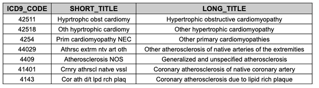

#### Text Data

##### Data Extraction and Cohort selection

Text data originated from the ```NOTEEVENTS.csv``` file in MIMIC III. Unique notes are stored one per line, alongside other data factors such as ```SUBJECT_ID```, note type, note sub-type, and multiple forms of timestamp. On further inspection of the csv file, we found that while ```NOTEEVENTS``` contains over 2 million notes, it only represents 46,146 unique patients. This was a limiting factor in our study, so we had to handle our cohort selection as follows: 

* Find the unique ```SUBJECT_ID```s in the text data
* Find the unique ```SUBJECT_ID```s with the given ICD9 codes
* Join on ```SUBJECT_ID```
* Select only those subjects with notes data AND ICD9 codes of interest

From here, we wanted to start with a streamlined approach to text classification. We begin by taking only the most recent note per patient. While there are more sophisticated approaches to this task, we began building our working pipeline with the simplest approach.

Notes come in multiple categories. After consultation with a physician, we learned that note categories like ‘Nursing’ and ‘Nursing/Other’ typically contain less predictive information that other categories like ‘Radiology’, ‘Discharge Summary’, ‘ECG’, and ‘Echo.’ 

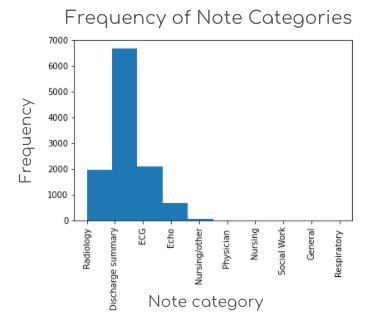

After constructing our streamlined dataframe of the most recent note per unique patient, we looked at the resulting distribution of note categories. As seen in the figure above, there is one patient with a note of category ‘Nursing/other’. On further inspection of the data, we found that this patient only has one note, so there is no opportunity to pull a more predictive note for this patient. All other patient notes were of the more predictive note categories, so we decided this method was an acceptable baseline for further analysis.

As described in the [Issues Encountered and Solutions](#issues-encountered-and-solutions-for-future-work) section, more careful inclusion and exclusion criteria may build a more refined cohort for future classification studies.

##### Preparing vectors for Classification


We need to vectorize the note data before sending it to our classifiers. To do so, we will first clean and tokenize the text data. Then, we will train a vectorizing model. We will use the model to vectorize each document to a vector of a standard length. We will then prepare these vectors to be passed to the classifier, both alone and with non-text data.

The cleaning and tokenizing of the corpus was completed using a single custom function. In the initial work of this project, we cleaned the data using normalization, making all capital letters into lower case letters. This ensures that the tokens ```RADIOLOGY```, ```Radiology```, and ```radiology``` are weighted equally in our vectorization model. In this step, there is opportunity to conduct further data cleaning using steps like lemmatization or the removal of stop words. In the interest of time and simplicity in our first working pipeline, we elected to save these steps for future work. Tokenizing the data was completed using the ‘punkt’ dataset with an English dictionary. Tokenization was completed at the word-level. This means single english words were not broken into further sub-tokens. However, the impacts of a smaller tokenization scheme on document vectorization with subsequent classification is an opportunity for further research.

##### Vectorization of Note Data - selecting our approach

In homework 4, we vectorized at the word level. This means that each word within a total corpus of words was tokenized, and each token was given a vector. The vectors represent weights. Weights are assigned based on the vectorized word’s relationship and proximity to other words, given the corpus on which the vectorization model is trained. We used Word2Vec.

In homework 5, we vectorized at the document level. We used a classical approach with one-hot encoding of each token within the document. The resulting data frame of document vectors (each row representing a single vectorized document) contained a series of 1’s and 0’s. Column names represent the top tokens throughout the entire corpus. Each row contains a 1 in columns titled with a token that lies within that document. This method is carried out using CountVectorizer, but it does not include weights, and has a few down-sides. It is typically more bulky than weighted vectorization methods. It also incurs data loss when the columns are cut down to only the top tokens within the corpus, i.e. less-frequent tokens will be cut from the resulting vector. 

In this project, we want to classify at the document level. As such, we have a few options:
ave a few options:

1. Use Word2Vec
	* Our goal is to classify at the document level. Word2Vec will provide one vector of standard length per word. Each document will contain a list of vectors (of standard length). However, the length of the list will vary depending on the length of the document and its resulting tokens. Therefore, this method produces a unique dataframe per document. While each data frame will contain the same number of columns, it will not contain the same number of rows. Longer documents will have dataframes with more rows.
	* One method to handle this is summing over all rows per column to convert the unstandardized 2D matrix to a 1D vector of standard shape per document. However, the summation and data aggregation may result in 
2. Use CountVectorizer
	* Our documents are very long and contained several thousand tokens per document. Therefore, we would either have to run this method and incur data loss (cutting low-frequency tokens), or run with bulkier data and pass the computational pattern-finding steps to the classifier, instead of running them earlier in the vectorization step.
3. Try a new approach: Doc2Vec [13]
	* Doc2Vec is the same model with the same two architecture options (Continuous Bag of Words and SkipGram; retitled Paragraph Vector Distributed Memory and Paragraph Vector Distributed Bag of Words, respectively). Doc2Vec was made by the same researchers who developed Word2Vec, but it was designed to operate at a different level of hierarchical text data. If we consider the top tier of text data to be the corpus, the next level is documents, followed by paragraphs, sentences, and words. Where Word2Vec (with either architecture) operates at the word level, Doc2Vec operates at the document level, and removes the summing and aggregation steps outlined in bullet 1b.
	* Some studies demonstrate this approach to have greater accuracy in classification than aggregating over multiple Word2Vec vectors. [14]

We elected to run the Bag of Words architecture (retitled Paragraph Vector Distributed Memory) at the document level.

##### Vectorization of Note Data - running Doc2Vec

We ran our vectorizer to produce vectors of the same length (n=438) as those created in the non-text data. Non-text data preparation will be described in the following section.

The vectorizer was trained on 70% of documents within the corpus. Ideally, we would train our vectorizer on a separate corpus from that which we will use to classify. However, as we are limited by dataset size and project timeline, we opted for this simplistic approach. We trained the model on 10 epochs. Some publications demonstrate better classification after additional epochs. [15] For a simple approach to developing our working pipeline, we used only 10 epochs, but plan to increase this number as guided by current literature.

Similar to document classification in homework 5, we converted our resulting document vectors to a dataframe. Vector weights were organized into columns by their index. This creates an identical data shape and type to that of the non-text data. Therefore, we may use the same classification model architecture on both separately, and on their combination.

#### Non-text Data

##### Introduction and Rmd Script

In order to collect and process the non-text data from MIMIC, we created a R script in R markdown which has been fully documented, commented, and organized. The Rmd file can be found on our GitHub repository at: [mimic\_processing.Rmd](https://github.com/a-ram-1/cbb-750-final/blob/master/nontext/mimic_processing.Rmd). While the details of the processing are given in the Rmd file, below we give a brief summary of the processing workflow as well as relevant details of how the non-text data relates to our downstream analysis.

##### Data Selection and Loading the Data

We prioritize using the ```LABEVENTS``` and ```D_LABITEMS``` tables for this section, as was recommended by MIMIC. Our goal in this section was to efficiently load and process the data. Because the data is extremely large, we made use of two key packages: ```data.table``` and ```dplyr```. The first package, ```data.table```, allows for fast and efficient loading/reading/writing of large scale data. Read functions in the ```data.table``` package outperform traditional functions such as ```read.csv``` by multiple magnitudes. The second package, ```dplyr```, is part of the R tidyverse suite, which aims to make large scale data processing and aggregation more efficient. Specifically it allows for grouping similar tags or IDs, and performing functions on each unique group. We heavily rely on this to perform our aggregation, which is described in detail below.

##### Filtering the data for most recent values

An important aspect to consider when aggregating values is the time at which a measurement was taken. Often, the most relevant time points to consider are the most recent measurements, as they provide the most up to date information of an individual. As such, we aimed to parametrize this aspect. To do so, we created unique IDs representing a combination of the subject, variable, and time point. We then used the dplyr package to only select n most recent time points. We can consider this value of _n_ to be the recency parameter. This was done using both ```Date``` and ```slice``` functions within the ```dplyr```` function. Due to the parametrization of the recency parameter, we are able to create various versions of the data that take into account different amounts of time points. (See [Issues Encountered and Future work](#issues-encountered-and-solutions-for-future-work), where we perform a comparison between different recency parameter usage).

##### Aggregating the table to create an organized data frame

Now that we have the filtered data for a certain recency parameter, we aim to aggregate the values by their mean. Specifically, a subject could have multiple measurements taken for the same variable (for a given recency parameter), and taking the mean would allow these values to be aggregated together. This is an important step so that we can limit the total number of variables to be the same between all individuals. Additionally, by aggregating with the mean, the variables are more stable. To aggregate with the mean, the ```dplyr``` package was employed. Another unique ID representing a subject-variable pairing was generated. For each of these unique IDs, the dplyr package functions ```group_by``` and ```summarize``` were used to do the final aggregation. The resulting data frame output consists of rows of subjects and columns of variables. The figure below shows an example of what the output data frame looks like:

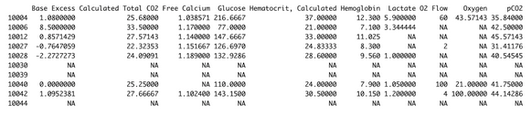

Because not every subject had a measurement for each variable, many missing or NA values were present. The figure below shows how many non NA values are present for each variable. We additionally explore imputation methods as well as the effect of these missing values in later sections of the project.

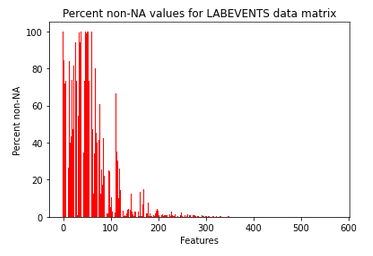 

The outputs from the non-text data processing were then used in the classification models, as described in the later sections of the project.

#### Text and non-text data

All remaining presented work is performed in [CBB\_750\_final\_project.ipynb](https://github.com/a-ram-1/cbb-750-final/blob/master/CBB_750_final_project.ipynb). We created a text+non-text data frame by merging our text and non-text matrices on the basis of ```SUBJECT_ID```. We intended on using this to assess whether or not combining our sources of data appreciably alters classifier performance, either by decreasing accuracy/AUC or by, potentially through a synergistic effect, improving classifier performance.

### Label generation

We generated labels for our text, non-text and combined text+non-text data frames using an identical approach. For the sake of consistency, this is the same label generation procedure used when producing labels for Doc2Vec tagging. We ran the following steps on each dataframe:

1. We find each patient's ICD9 code
  * When isolating CAD/CM patients, we set up a dataframe linking SUBJECT_ID to ICD-9 code. We always use this dataframe to identify each patient’s ICD-9 code.
2. Label cardiomyopathy ICD codes as 0 and CAD as 1
  *   Cardiomyopathy codes are  [425.11](http://www.icd9data.com/2014/Volume1/390-459/420-429/425/425.11.htm), [425.18](http://www.icd9data.com/2014/Volume1/390-459/420-429/425/425.18.htm) and [425.4](http://www.icd9data.com/2014/Volume1/390-459/420-429/425/425.4.htm)
  * CAD codes are [440.29](http://www.icd9data.com/2014/Volume1/390-459/440-449/440/440.29.htm), [440.9](http://www.icd9data.com/2014/Volume1/390-459/440-449/440/440.9.htm), [414.01](http://www.icd9data.com/2014/Volume1/390-459/410-414/414/414.01.htm) and [414.3](http://www.icd9data.com/2014/Volume1/390-459/410-414/414/414.3.htm)
3. Add all labels to an array that we use for classification.

We chose to use these repetitive code blocks in an attempt to mitigate mislabeling throughout the three dataframes. Mislabeling can decrease classifier performance. It is therefore of paramount importance to carefully and correctly assign labels, particularly while tuning working pipelines to optimize classifier performance.  


### Classification

To classify, we first split the data into training/testing sets. We always used a 70-30 train-test split to facilitate comparison across datasets. We also used the same train/test sets for all classifiers for a given dataset.

We used the following classifiers:
* GLM [logistic regression]
* GLM with AdaBoost
* Decision tree
* Decision tree with AdaBoost
* SVM
* Random forest
* Majority vote

Logistic regression, decision tree and SVM classification are all commonly used for binary classification therefore we deemed them appropriate to use for our task.[14] We were also familiar with decision trees and SVMs, having worked with them for homework 5. We also employed multiple ensemble classification approaches with the intention of improving GLM/decision tree/SVM performance. We first ran AdaBoost, as it demonstrably improves decision tree performance and can be used with other classifiers, e.g. GLM.[16] Random forest has been shown to outperform decision trees for datasets with 5000-20000 points.[17] Given that our dataset has over 11000 points we therefore decided to try random forest along with our other algorithms. Finally, we used a majority vote to determine whether combining output from all our other classifiers would provide a more robust set of classifications.

Notably, we were unable to run AdaBoost with the SVM classifier. The default AdaBoost algorithm ```SAMME.R``` does not work with SVMs, meaning we would have had to use the slower-converging and more error-prone algorithm ```SAMME```.[18] Ultimately, due to runtime constraints we decided to not run this model.

### Model validation and performance assessment


We used three approaches to assess model performance. First, we ran a simple accuracy assessment by counting the number of misclassified points and finding the error rate of each model. [From hereon this will be referred to as the “simple accuracy” measure.]

We recognize, however, the limitations of such an accuracy metric. Our train-test split could be biased such that a crucial set of features is most often seen in the test set, not the training set. As such, we can run k-fold cross validation [with k=10] to ensure that every point in the original dataset can appear in both the training and test data sets and to provide a more reliable accuracy score.[19] We take a mean accuracy assessment over all folds to get an average accuracy estimate that should be less prone to bias than the simple approach. We report this k-fold accuracy in terms of error rate, i.e. 1-accuracy.

Additionally, we use ROC curves/AUC to provide a more complete assessment of model performance as they are generally considered to be more reliable than simple accuracy measures.[20] Together, these three validation/performance assessment measures provide us with an informative and reliable evaluation of each classifier.


## Results

### Model performance evaluation

We have listed the simple accuracy, k-fold accuracy and AUC of each model with each dataset in the following table. We use error rate to report accuracy-since the differences in error are often within 0.1% of each other we thought this metric would more easily highlight differences. The highest performers in each category are highlighted in red.

We note that no trends emerge with regards to classifier performance when viewing the simple accuracy estimates. For each dataset, a different classifier/set of classifiers have the lowest error rate/highest accuracy. Random forest, notably, has the lowest error for both non-text and text+non-text data. In all cases, the error is between 11-21%.

We note that random forest consistently has the lowest k-fold error rate across datasets. These k-fold error rates do not necessarily correspond with the simple error rates. While the classifiers with lowest error/k-fold error are one and the same for the non-text and text+non-text datasets, this is not the case for the text data. Here, the majority vote has the lowest simple error rate while the GLM and random forest have the lowest k-fold error rate. We can attribute this discrepancy to the fact that simple accuracy only accounts for one partition of the data while k-fold accuracy is calculated by averaging results from different data partitions. Overall, this k-fold error lies between 11-23%.

Now we move to AUC. Interestingly, the models with highest AUC also had the highest error rate. For non-text data, the only classifiers with AUC>0.5 were the decision tree and decision tree with boosting. These two classifiers also had by far the highest error rates. While the other classifiers had a simple/k-fold error rate around 11-12%, both decision tree approaches had a simple/k-fold error above 21%.

Incorporating the text data appears to increase AUC above 0.5 in almost all classifiers [apart from the GLM]. However, the same discrepancy persists. Decision tree has the highest AUC and the second highest simple/k-fold error rate. Decision tree with boosting has the second highest AUC and highest simple/k-fold error rate. When analyzing the text+non-text data, decision tree with boosting has the highest AUC, simple error and k-fold error.


To better analyze the trends in accuracy/AUC over the different datasets, we turn to the following figures. We first look at simple accuracy.

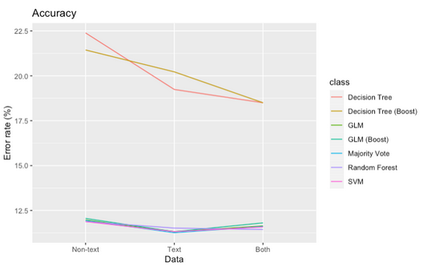

We reiterate that decision tree and decision tree with boosting have by far the highest error rate. There is no immediately apparent trend in error rate across data types. We can further examine accuracy without decision tree measurements as they obscure visualization of the other classifier values.

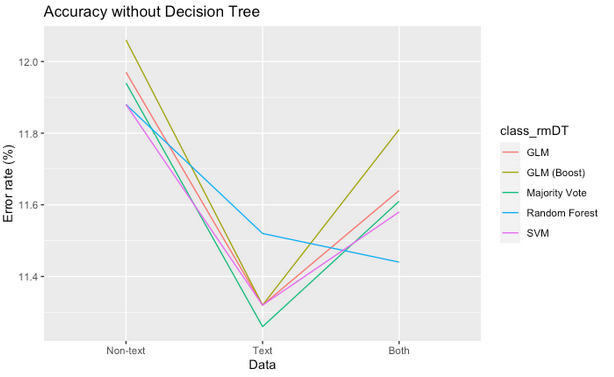

The only generalizable trend here appears to be the fact that the classifiers had a lower error rate when trained on text data. For the GLM, GLM with boosting, majority vote and SVM, the non-text + text error rate is lower than non-text only but higher than text-only. Conceivably, adding the non-text data may introduce noise and decrease classification ability [or conversely, adding text data increases classification ability by introducing salient variables]. The difference in accuracy among all three datasets, however, is at most ~0.6% for a given classifier. That is not enough to draw any substantive conclusions.

We can next analyze the k-fold accuracy. It appears that adding text data decreases decision tree/decision tree with boosting error rates by ~5% when comparing non-text to text+non-text results. The difference is noticeably smaller for the other models.

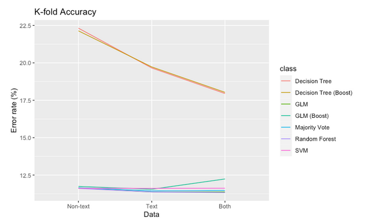

When looking at the other models, a trend becomes less easily discernible. In the case of the GLM with boosting, text data achieves a lower error than non-text, but combining the two increases the error rate by almost 1%. In the case of the SVM, the error rate is nearly static, with a slight increase from non-text to text to text+non-text data. In all other instances, text data achieves a lower error than non-text, but combining the two increases the error slightly. These divergent trends do not provide a stable basis upon which to base any substantive conclusions. We can, however, appreciate that the text data has had a nontrivial impact on decision tree/decision tree with boosting accuracy.


Finally, we investigate AUC. Once more we display these scores with/without decision tree values as they prevent clear visualization of the other values. It appears that, except for the GLM [whose AUC remained constant throughout], classifiers reported lower AUC on text data versus non-text data. The AUC on text+non-text data was higher than that of text data alone. With the exception of random forest and majority vote, it was also higher than that of non-text data. For a given classifier, these differences are within 0.08 of one another, which is not enough to establish a definitive trend or set of conclusions.

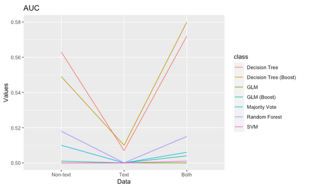

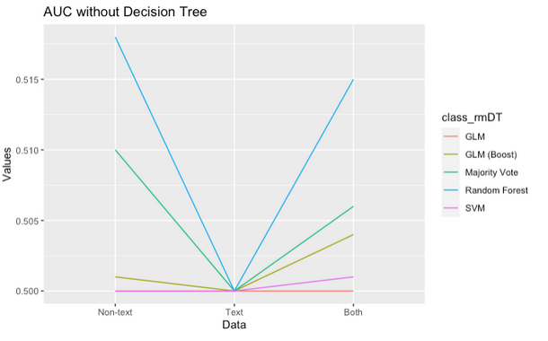

Since the differences in classifier performance for each dataset tend to be within 1% for accuracy or 0.01 for AUC, we conclude that there is no appreciable or significant difference in performance over the different datasets.

### Feature importance


After evaluating accuracy and AUC, we sought to understand how the data structure itself influenced our classifier’s poor performance. Specifically, how informative were each of its features? We plotted feature importance for all classifiers except the GLM with AdaBoost, SVM and majority vote. The AdaBoostClassifier feature is structured to only calculate feature importance using the decision tree parameter ```feature_importances_```, as opposed to the GLM parameter ```coef_```. [17]  This in turn prevents us from extracting feature information from the classifier. The SVM and majority vote both nonlinearly transform the feature space and therefore do not allow for an informative assessment of feature importance.

We summarize results below. For GLM plots, positive values are predictive of class 1 [CAD] and negative ones are predictive of class 0 [CM]. For all other plots, values indicate the weight given to a feature during classification.


#### Non-text feature importance

Earlier features appear to be more predictive than features in later columns of the input data frame. 

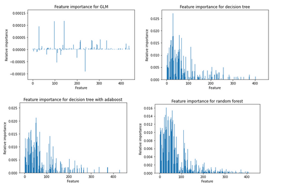


#### Text feature importance

All features seem to be of similar importance, while few are substantially more important than others. It would be interesting to see these plots given vectors from other methods of vectorization, as described in the [Text data](#text-data) section of this report.

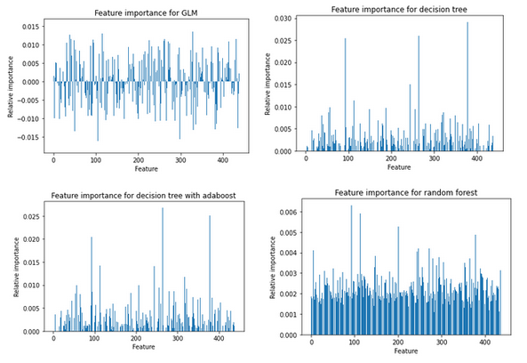

#### Text+non-text feature importance

Concatenation of multimodal data types appears to have impacted feature importance dramatically. The GLM shows limited features used in prediction of Cardiomyopathy and disproportionate use of early factors. In the multimodal dataframes, early factors are always text vectors.

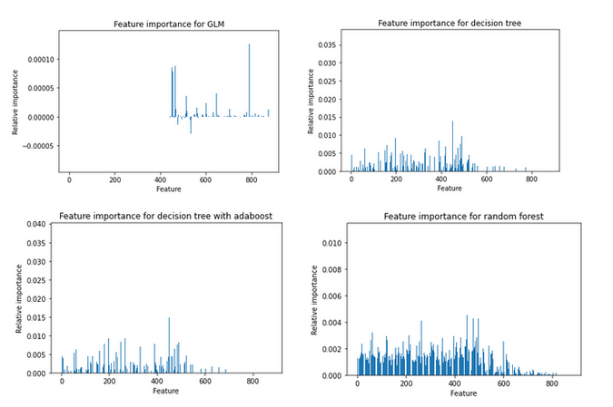


## Issues Encountered and Solutions for Future Work

### Adjustments made after final presentation

We performed the following adjustments and made the subsequent considerations upon receiving feedback when this work was presented:

* Non-text Data
    * Problem: Exploring the relevance of recency in non-text data is an important clinical factor
        * Since clinical lab results can vary greatly depending on the current status of an individual, we expect that there could be large variability across different time points of the same variable for a given individual. Therefore, it is important to note that the recency in which we aggregate the data is important. We tried various versions of this and showed that when taking more recent values as opposed to aggregating the whole dataset, a marginal improvement in performance was obtained. Specifically the error rate decreases from 12.1% to 11.8% in Random Forest, when considering only the three most recent values. This aspect can be explored further with consultation with a physician. It is also important to note that there could be different “recency” aggregation parameter settings that would work better for some patients than others, so this point is complex and is worth exploring to further improve the model.
    * Potential Solution: Use alternative imputation procedure on non-text data as using the column mean is a naive approach
        * Additionally, since many of the columns are composed of majority-NA values this could actually be confounding results 
            * Could select the most relevant features and use them for classification

* Text Data
    * Problem: “Most recent” ```NOTEEVENTS```/```LABEVENTS``` values are hard to actually find
* ```NOTEEVENTS``` dates are weirdly into the future
* As discussed with Dr. Jarad in the final presentation, most recent ```NOTEEVENTS```/```LABEVENTS``` values may not be the most accurate as the patient may be improved/on their way to discharge by then
* Patients could have died 
* Patients could have moved hospitals. 
    * Potential Solution: Use the 3 most recent notes/lab readings from a patient. 
* However, this solution runs the risk of including unrelated or outdated readings [e.g. 2 most recent readings for a patient are a year apart] 
* Furthermore, we could be including notes that are not pertinent to classification (like nursing notes, etc.) Some patients only have nursing notes, so they would either have to be coded in as an exception to the rule, or removed via exclusion criteria. Therefore, this method was pushed to further work as it will take significant time to accurately clean the dataset and remove superfluous 
    * Problem: Doc2Vec may not be the best solution
        * While some studies demonstrate Doc2Vec as having better vectorization for document level classification, accuracy depends on document number and document length. These factors should be considered in future work.
    * Potential Solution: Use Word2Vec and conduct a system of concatenation and aggregation
        * These options are now fully outlined in our report. Some supporting research articles are referenced in the report section: [Methods](#methods)/[Text Data](#text-data)/[Vectorization of Note Data - selecting our approach](#vectorization-of-note-data---selecting-our-approach).
* Cross-validation
    * Problem: We had not run cross-validation on our model prior to presenting. 
    * Solution: We now run k-fold cross-validation [k=10] and gather a mean accuracy estimate/error rate. We have presented these error rates in our results section and updated [CBB_750_final_project.ipynb](https://github.com/a-ram-1/cbb-750-final) to run k-fold on all classifiers

### Class imbalance in the data

One contributing factor to low model performance may be the class imbalance in our data. Of all patients in the MIMIC-III data set, 5,380 patients have Cardiomyopathy and 40,960 have CAD. Our distribution of data in classifier training and test sets is demonstrated in the histograms below.

Histograms of training labels: 

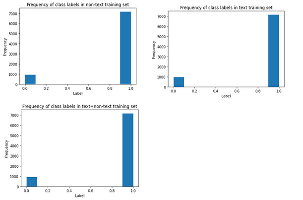

Histograms of test set labels: 

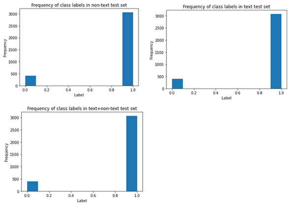

We would expect such distributions to lead to a classifier that works too well. The classifier would train on prevalence rather than actual factors within the data, causing model underfitting. However, our model performance is low, suggesting the low predictive power stems from something else. It's possible that Cardiomyopathy and CAD are not easily separable by the factors included in our model.

### Non-text data structure

We wanted to better understand performance for the non-text matrix especially given that our AUC scores were so consistently near 0.5. We wondered if our imputation process had been causing issues and therefore plotted the percent non-NA values for our non-text matrix. This produced the following result:


It is crucial to note that, out of the 439 columns/features in this matrix, all columns past ~110 are >=80% NA. In these instances, we are treating a small fraction of samples as representative of our overall population and generating a mean based on their feature values. This means, first, that these columns are filled almost entirely with identical values and second, that these means are likely based on a skewed sample of the population and are not representative of the whole. This in turn can bias our results.

It is worth noticing that the decision tree/random forest--though not the GLM--appear to take this into account and treat the first ~100 features as the most informative:


However, some of these later features are still being used for classification. One approach we could take to reduce the effect of majority-NA columns on classification would be to only base classification on the ~100 most informative features. Since we do not know how the feature space impacts GLM with AdaBoost/SVM/majority vote classification, however, this could further bias our results. Features that are salient for decision tree prediction may be of little to no use for the GLM with AdaBoost.

We could also try an alternative imputation procedure that would provide more informative results even for columns with majority non-NA values. Options would include median value, a regression-based imputation or a multiple imputation approach.

### Using alternative classification approaches

We propose the following amendments to our approach, all of which may improve performance:

* We could scale the data--this may especially help for the text + non-text classification as the GLM, and potentially other models, appear to be overweighting the non-text data [last 438 columns] versus the text data [first 439 columns]:
    * 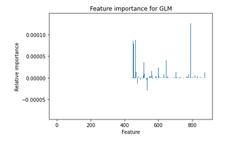
* We were unable to run the SVM with AdaBoost. We could rerun all AdaBoost models with ```SAMME``` instead of ```SAMME.R``` to facilitate comparison and run the SVM with AdaBoost. This would undoubtedly increase overall runtime and could also contribute to lower accuracy.
* We could run a different GLM -- perhaps logistic regression is not appropriate for the task or the data is too noisy for it to be cleanly separable.
* We could try a different SVM kernel -- we just used the standard one [radial basis]. Working too much to get the right kernel, however, can be both time intensive and risk overfitting.
* We could try bagging to mitigate the effects of data variance/noise.
* We could take a different approach to reporting k-fold performance. Mean values have a tendency to flatten out variation in a distribution, so perhaps median is more appropriate.
* We could increase AdaBoost max iterations for GLM or try a different solver that’s not ```lbgfs```, as we got this error when running the GLM/GLM with boosting:
    * 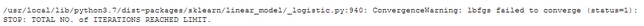

All these classification approaches can only work if our data is separable in some meaningful way -- given confounding factors that we did not account for [e.g. you can be diagnosed with both CM/CAD] and the fact that both conditions have similar symptoms that can therefore produce similar test results/clinician notes, we would have to either clean our data to reduce confounding noise or attempt to incorporate other data from MIMIC databases to provide a more meaningful resolution to this problem/make our data more easily separable.

Any additional work done on this project would primarily involve cleaning our data and fine-tuning our models’ hyperparameters to improve upon our baseline accuracy and AUC performance.

## Conclusion

While this novel pipeline with multimodal data did not perform as well as we had hoped, it serves as a working pathway for further studies, and clear demonstration of knowledge and understanding of course principles.

Our classification using multiple different models allows us to see if performance varies between models. However, because they all performed relatively poorly, the bulk of the future work is in tuning the models. Part of appropriately tuning the model involves refining data preparation and cleaning as well as adjusting inclusion and exclusion criteria for cohort selection.

Once our classifier has a better accuracy, we could use the novel pipeline built in this study as a method of benchmarking studies using the MIMIC-III dataset. Alternatively, we could use the novel pipeline, trained on MIMIC-III data, to predict classifications for Yale data. This test will measure generalizability of the models and identify any overfitting which may occur.

## Bibliography

1. Kruska, M., El-Battrawy, I., Behnes, M., Borggrefe, M. & Akin, I. Biomarkers in Cardiomyopathies and Prediction of Sudden Cardiac Death. Curr Pharm Biotechnol 18, 472-481, doi:10.2174/1389201018666170623125842 (2017).
2. Trethewey, S. P., Nicolson, W. B. & Ng, G. A. Investigation of the relationship between two novel electrocardiogram-based sudden cardiac death risk markers and autonomic function. J Electrocardiol 51, 889-894, doi:10.1016/j.jelectrocard.2018.07.013 (2018).
3. Institute of Medicine (US) Committee on Social Security Cardiovascular Disability Criteria. Cardiovascular Disability: Updating the Social Security Listings. Washington (DC): National Academies Press (US); 2010. 5, Heart Failure, Cardiomyopathy, and Right Heart Failure. Available from: [https://www.ncbi.nlm.nih.gov/books/NBK209980/](https://www.ncbi.nlm.nih.gov/books/NBK209980/)
4. Melacini, P. et al. Clinicopathological profiles of progressive heart failure in hypertrophic cardiomyopathy. Eur Heart J 31, 2111-2123, doi:10.1093/eurheartj/ehq136 (2010).
5. Nicolson, W. B. et al. Prospective evaluation of two novel ECG-based restitution biomarkers for prediction of sudden cardiac death risk in ischaemic cardiomyopathy. Heart 100, 1878-1885, doi:10.1136/heartjnl-2014-305672 (2014).
6. Rakowski, H. Determining Hypertrophic Cardiomyopathy Mortality: Gaining Wisdom From Knowledge. JAMA Cardiol 5, 81-82, doi:10.1001/jamacardio.2019.4548 (2020). 
7. Nicolson, W. B., Smith, M. I., Vali, Z., Samani, N. J. & Ng, G. A. Application of two novel electrical restitution-based ECG markers of ventricular arrhythmia to patients with nonischemic cardiomyopathy. Pacing Clin Electrophysiol 44, 284-292, doi:10.1111/pace.14143 (2021).
8. Boudoulas, K. D., Triposciadis, F., Geleris, P. & Boudoulas, H. Coronary Atherosclerosis: Pathophysiologic Basis for Diagnosis and Management. Prog Cardiovasc Dis 58, 676-692, doi:10.1016/j.pcad.2016.04.003 (2016).
9. Lloyd-Jones, D. et al. Heart disease and stroke statistics--2009 update: a report from the American Heart Association Statistics Committee and Stroke Statistics Subcommittee. Circulation 119, 480-486, doi:10.1161/CIRCULATIONAHA.108.191259 (2009).
10. McCrohon, J. A. et al. Differentiation of heart failure related to dilated cardiomyopathy and coronary artery disease using gadolinium-enhanced cardiovascular magnetic resonance. Circulation 108, 54-59, doi:10.1161/01.CIR.0000078641.19365.4C (2003).
11. Matsuzawa, Y. & Lerman, A. Endothelial dysfunction and coronary artery disease: assessment, prognosis, and treatment. Coron Artery Dis 25, 713-724, doi:10.1097/MCA.0000000000000178 (2014).
12. Luis Fuentes, V. & Wilkie, L. J. Asymptomatic Hypertrophic Cardiomyopathy: Diagnosis and Therapy. Vet Clin North Am Small Anim Pract 47, 1041-1054, doi:10.1016/j.cvsm.2017.05.002 (2017).
13. Q Le, T Mikolov (2014). Distributed representations of sentences and documents International conference on machine learning - proceedings.mlr.press
14. Han Lau, J., & Baldwin, T. (2016). An Empirical Evaluation of doc2vec with Practical Insights into Document Embedding Generation. Proceedings of the 1st Workshop on Representation Learning for NLP 78–86.
15. Chao, C. M., Yu, Y. W., Cheng, B. W., & Kuo, Y. L. (2014). Construction the model on the breast cancer survival analysis use support vector machine, logistic regression and decision tree. Journal of medical systems, 38(10), 1-7.
16. Pandey, P., & Prabhakar, R. (2016, August). An analysis of machine learning techniques (J48 & AdaBoost)-for classification. In 2016 1st India International Conference on Information Processing (IICIP) (pp. 1-6). IEEE.
17. Ali, J., Khan, R., Ahmad, N., & Maqsood, I. (2012). Random forests and decision trees. International Journal of Computer Science Issues (IJCSI), 9(5), 272.
18. sklearn.ensemble.AdaBoostClassifier — scikit-learn 0.22.1 documentation. (n.d.). Scikit-Learn.org. Retrieved May 7, 2021, from [https://scikit-learn.org/stable/modules/generated/sklearn.ensemble.AdaBoostClassifier.html](https://scikit-learn.org/stable/modules/generated/sklearn.ensemble.AdaBoostClassifier.html)
19. Wong, T. T., & Yeh, P. Y. (2019). Reliable accuracy estimates from k-fold cross validation. IEEE Transactions on Knowledge and Data Engineering, 32(8), 1586-1594.
20. Linden, A. (2006). Measuring diagnostic and predictive accuracy in disease management: an introduction to receiver operating characteristic (ROC) analysis. Journal of evaluation in clinical practice, 12(2), 132-139.


