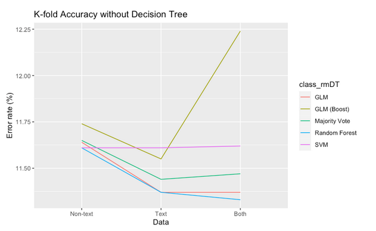

# Classifying cardiomyopathy v. coronary artery disease for patients with and without vectorized text data

### Author contributions available [here](contributions.md) 

## Abstract

Cardiomyopathy and coronary artery disease (CAD) are associated with correlated symptoms and other physiologic measures and both lead to the same downstream effects, namely heart failure, thereby making it difficult to distinguish between the two. Differentiation between cardiomyopathy and CAD is therefore important because treatment for each disease is different. However, there are no appropriate predictive algorithms for classifying cardiomyopathy and CAD for patients yet. Here we use doc2vec and an ensemble of machine learning classification approaches to better address the differentiation problem using both text data and non-text data. The aim of this project is to develop a predictive algorithm to differentiate between cardiomyopathy and CAD patients. Diagnosis can be completed through invasive testing like angiograms, so opportunities to predict differentiation without the use of invasive procedures may lead to better patient outcomes and decreased hospital costs.

## Introduction and Background

Heart failure is a condition in which the heart cannot provide enough blood flow to meet the body's demand for oxygenated blood during regular activity, or when pressure within the heart rises. Heart failure is not a single disease, but a chronic and progressive condition that can be the ultimate common pathway for several structural or functional heart diseases that impair the ability to fill or empty the heart.[1] Heart failure can occur when the heart muscle is weak which is called systolic failure or when it is stiff and cannot relax normally which is called diastolic failure. 

Heart failure caused by weakened pumping strength occurs with a left ventricular ejection fraction (EF) less than 40 percent. Heart failure with low EF is associated with enlargement of the heart, which is the most common type of heart failure in patients younger than age 65. Cardiomyopathy and CAD are the main causes of this heart failure type. Cardiomyopathy is a disorder which affects cardiac muscle, making systemic circulation difficult.[2] It is one of the main causes of heart failure in all age groups and sudden cardiac death in young people.[3,4] Mortality of cardiomyopathy patients is 3.4% according to the 2020 JAMA cardiology report.[5] While cardiomyopathy is a disease of the heart muscle(Institute), CAD is a failure of the blood vessels.[6] CAD causes irreversible damage to the heart muscle and failures in systemic circulation.[2]

Heart failure is a continuing public health problem in the United States. The prevalence of heart failure in the adult population over the age of 20 is 2.6%.[2] In the United States, about 5.8 million people suffer from heart failure, with over 1 million hospitalizations each year, and 12 to 15 million patients annually visiting treating doctors.[7] Even though accurate diagnosis is important to properly treat patients with symptoms due to heart failure, the current diagnosis methods such as echocardiography, nuclear imaging tests or magnetic resonance imaging (MRI) can lead to confusion due to similar symptoms in different causes of heart failure. For example, cardiomyopathy and CAD that are the main causes of heart failure have indistinguishable symptoms such as fatigue, breathlessness, chest pain or dizziness.[8,9]  However, different strategies of treatments are required for either cardiomyopathy or CAD. The treatments for cardiomyopathy should focus on the recovery of the heart muscle, and for CAD treatment, the clogged arteries should be opened to allow good blood flow.[8,10]

Therefore, it is important to predict differentiation between cardiomyopathy and CAD without the use of invasive procedures, but there are no appropriate predictive algorithms for classifying cardiomyopathy and CAD for patients yet. In this project, we aim to develop a predictive algorithm to differentiate between cardiomyopathy and CAD patients to improve diagnostic accuracy and reduce the need for invasive diagnostic procedures. 

## Methods

### Workflow Schematic


### Data Source

We used the Medical Information Mart for Intensive Care III (MIMIC-III) dataset from Massachusetts Institute of Technology (MIT) Lab for Computational Physiology. The dataset contains 11 years of de-identified health records from Intensive Care Unit patients. It features lab results, doctor notes, diagnoses, medicines, and more. We used ```NOTEEVENTS```, ```D_ICD_Diagnoses```, ```DIAGNOSES_ICD```, ```CHARTEVENTS```, ```LABEVENTS```, ```D_ITEMS``` and  ```D_LABITEMS``` tables from MIMIC-III data source.


### Data Extraction and Processing

#### ICD-9 Codes

#### Text Data

##### Data Extraction & Cohort selection


##### Preparing vectors for Classification

##### Vectorization of Note Data - selecting our approach

##### Vectorization of Note Data - running Doc2Vec

#### Non-text Data

##### Introduction and Rmd Script

##### Data Selection and Loading the Data

##### Filtering the data for most recent values

##### Aggregating the table to create an organized data frame

#### Text and non-text data

All remaining presented work is performed in [CBB\_750\_final\_project.ipynb](https://github.com/a-ram-1/cbb-750-final/blob/master/CBB_750_final_project.ipynb). We created a text+non-text dataframe by merging our text and non-text matrices on the basis of ```SUBJECT_ID```. We intended on using this to assess whether or not combining our sources of data appreciably alters classifier performance, either by decreasing accuracy/AUC or by, potentially through a synergistic effect, improving classifier performance. 

### Label generation

We generated labels for our text, non-text and combined text+non-text dataframes using an identical approach. For the sake of consistency, this is the same label generation procedure used when producing labels for doc2vec tagging. We ran the following steps on each dataframe: 

1. We find each patient's ICD9 code
	* When isolating CAD/CM patients, we set up a dataframe linking SUBJECT_ID to ICD-9 code. We always use this dataframe to identify each patient’s ICD-9 code.
2. Label cardiomyopathy ICD codes as 0 and CAD as 1
  *   Cardiomyopathy codes are  [425.11](http://www.icd9data.com/2014/Volume1/390-459/420-429/425/425.11.htm), [425.18](http://www.icd9data.com/2014/Volume1/390-459/420-429/425/425.18.htm) and [425.4](http://www.icd9data.com/2014/Volume1/390-459/420-429/425/425.4.htm) 
  * CAD codes are [440.29](http://www.icd9data.com/2014/Volume1/390-459/440-449/440/440.29.htm), [440.9](http://www.icd9data.com/2014/Volume1/390-459/440-449/440/440.9.htm), [414.01](http://www.icd9data.com/2014/Volume1/390-459/410-414/414/414.01.htm) and [414.3](http://www.icd9data.com/2014/Volume1/390-459/410-414/414/414.3.htm)
3. Add all labels to an array that we use for classification.

We chose to use these repetitive code blocks in an attempt to mitigate mislabeling throughout the three dataframes. Mislabeling can decrease classifier performance. It is therefore of paramount importance to carefully and correctly assign labels, particularly while tuning working pipelines to optimize classifier performance.  


### Classification

To classify, we first split the data into training/testing sets. We always used a 70-30 train-test split to facilitate comparison across datasets. We also used the same train/test sets for all classifiers for a given dataset. 

We used the following classifiers: 
* GLM [logistic regression]
* GLM with AdaBoost
* Decision tree
* Decision tree with AdaBoost
* SVM
* Random forest
* Majority vote

Logistic regression, decision tree and SVM classification are all commonly used for binary classification therefore we deemed them appropriate to use for our task.[12] We were also familiar with decision trees and SVMs, having worked with them for homework 5. We also employed multiple ensemble classification approaches with the intention of improving GLM/decision tree/SVM performance. We first ran AdaBoost, as it demonstrably improves decision tree performance and can be used with other classifiers, e.g. GLM.[13] Random forest has been shown to outperform decision trees for datasets with 5000-20000 points.[14] Given that our dataset has over 11000 points we therefore decided to try random forest along with our other algorithms. Finally, we used a majority vote to determine whether combining output from all our other classifiers would provide a more robust set of classifications. 

Notably, we were unable to run AdaBoost with the SVM classifier. The default AdaBoost algorithm ```SAMME.R``` does not work with SVMs, meaning we would have had to use the slower-converging and more error-prone algorithm ```SAMME```.[15] Ultimately, due to runtime constraints we decided to not run this model.

### Model validation and performance assessment


We used three approaches to assess model performance. First, we ran a simple accuracy assessment by counting the number of misclassified points and finding the error rate of each model. [From hereon this will be referred to as the “simple accuracy” measure.] 

We recognize, however, the limitations of such an accuracy metric. Our train-test split could be biased such that a crucial set of features is most often seen in the test set, not the training set. As such, we can run k-fold cross validation [with k=10] to ensure that every point in the original dataset can appear in both the training and test data sets and to provide a more reliable accuracy score.[16] We take a mean accuracy assessment over all folds to get an average accuracy estimate that should be less prone to bias than the simple approach. We report this k-fold accuracy in terms of error rate, i.e. 1-accuracy. 

Additionally, we use ROC curves/AUC to provide a more complete assessment of model performance as they are generally considered to be more reliable than simple accuracy measures.[17] Together, these three validation/performance assessment measures provide us with an informative and reliable evaluation of each classifier. 


## Results

### Model performance evaluation

We have listed the simple accuracy, k-fold accuracy and AUC of each model with each dataset in the following table. We use error rate to report accuracy-since the differences in error are often within 0.1% of each other we thought this metric would more easily highlight differences. The highest performers in each category are highlighted in red. 

We note that no trends emerge with regards to classifier performance when viewing the simple accuracy estimates. For each dataset, a different classifier/set of classifiers have the lowest error rate/highest accuracy. Random forest, notably, has the lowest error for both non-text and text+non-text data. In all cases, the error is between 11-21%

We note that random forest consistently has the lowest k-fold error rate across datasets. These k-fold error rates do not necessarily correspond with the simple error rates. While the classifiers with lowest error/k-fold error are one and the same for the non-text and text+non-text datasets, this is not the case for the text data. Here, the majority vote has the lowest simple error rate while the GLM and random forest have the lowest k-fold error rate. We can attribute this discrepancy to the fact that simple accuracy only accounts for one partition of the data while k-fold accuracy is calculated by averaging results from different data partitions. Overall, this k-fold error lies between 11-23%.

Now we move to AUC. Interestingly, the models with highest AUC also had the highest error rate. For non-text data, the only classifiers with AUC>0.5 were the decision tree and decision tree with boosting. These two classifiers also had by far the highest error rates. While the other classifiers had a simple/k-fold error rate around 11-12%, both decision tree approaches had a simple/k-fold error above 21%. 

Incorporating the text data appears to increase AUC above 0.5 in almost all classifiers [apart from the GLM]. However, the same discrepancy persists. Decision tree has the highest AUC and the second highest simple/k-fold error rate. Decision tree with boosting has the second highest AUC and highest simple/k-fold error rate. When analyzing the text+non-text data, decision tree with boosting has the highest AUC, simple error and k-fold error. 


To better analyze the trends in accuracy/AUC over the different datasets, we turn to the following figures. We first look at simple accuracy. 


We reiterate that decision tree and decision tree with boosting have by far the highest error rate. There is no immediately apparent trend in error rate across data types. We can further examine accuracy without decision tree measurements as they obscure visualization of the other classifier values.


The only generalizable trend here appears to be the fact that the classifiers had a lower error rate when trained on text data. For the GLM, GLM with boosting, majority vote and SVM, the non-text + text error rate is lower than non-text only but higher than text-only. Conceivably, adding the non-text data may introduce noise and decrease classification ability [or conversely, adding text data increases classification ability by introducing salient variables]. The difference in accuracy among all three datasets, however, is at most ~0.6% for a given classifier. That is not enough to draw any substantive conclusions. 

We can next analyze the k-fold accuracy. It appears that adding text data decreases decision tree/decision tree with boosting error rates by ~5% when comparing non-text to text+non-text results. The difference is noticeably smaller for the other models. 


When looking at the other models, a trend becomes less easily discernible. In the case of the GLM with boosting, text data achieves a lower error than non-text, but combining the two increases the error rate by almost 1%. In the case of the SVM, the error rate is nearly static, with a slight increase from non-text to text to text+non-text data. In all other instances, text data achieves a lower error than non-text, but combining the two increases the error slightly. These divergent trends do not provide a stable basis upon which to base any substantive conclusions. We can, however, appreciate that the text data has had a nontrivial impact on decision tree/decision tree with boosting accuracy. 



Finally, we investigate AUC. Once more we display these scores with/without decision tree values as they prevent clear visualization of the other values. It appears that, except for the GLM [whose AUC remained constant throughout], classifiers reported lower AUC on text data versus non-text data. The AUC on text+non-text data was higher than that of text data alone. With the exception of random forest and majority vote, it was also higher than that of non-text data. For a given classifier, these differences are within 0.08 of one another, which is not enough to establish a definitive trend or set of conclusions.


Since the differences in classifier performance for each dataset tend to be within 1% for accuracy or 0.01 for AUC, we conclude that there is no appreciable or significant difference in performance over the different datasets.

### Feature importance


After evaluating accuracy and AUC, we sought to understand how the data structure itself influenced our classifier’s poor performance. Specifically, how informative were each of its features? We plotted feature importance for all classifiers except the GLM with AdaBoost, SVM and majority vote. The AdaBoostClassifier feature is structured to only calculate feature importance using the decision tree parameter feature_importances_, as opposed to the GLM parameter coef_.(samme)  This in turn prevents us from extracting feature information from the classifier. The SVM and majority vote both nonlinearly transform the feature space and therefore do not allow for an informative assessment of feature importance. 

We summarize results below:

#### Non-text feature importance

For GLM plots, positive values are predictive of class 1 [CAD] and negative ones are predictive of class 0 [CM]. For all other plots, values indicate the weight given to a feature during classification.


#### Text feature importance


#### Text+non-text feature importance


## Issues Encountered & Solutions for Future Work

### Adjustments made after final presentation

We performed the following adjustments and made the subsequent considerations upon receiving feedback when this work was presented: 

### Class imbalance in the data


### Non-text data structure

We wanted to better understand performance for the non-text matrix especially given that our AUC scores were so consistently near 0.5. We wondered if our imputation process had been causing issues and therefore plotted the percent non-NA values for our non-text matrix. This produced the following result: 


It is crucial to note that, out of the 439 columns/features in this matrix, all columns past ~110 are >=80% NA. In these instances, we are treating a small fraction of samples as representative of our overall population and generating a mean based on their feature values. This means, first, that these columns are filled almost entirely with identical values and second, that these means are likely based on a skewed sample of the population and are not representative of the whole. This in turn can bias our results. 

It is worth noticing that the decision tree/random forest--though not the GLM--appear to take this into account and treat the first ~100 features as the most informative: 


However, some of these later features are still being used for classification. One approach we could take to reduce the effect of majority-NA columns on classification would be to only base classification on the ~100 most informative features. Since we do not know how the feature space impacts GLM with AdaBoost/SVM/majority vote classification, however, this could further bias our results. Features that are salient for decision tree prediction may be of little to no use for the GLM with AdaBoost. 

We could also try an alternative imputation procedure that would provide more informative results even for columns with majority non-NA values. Options would include median value, a regression-based imputation or a multiple imputation approach.

### Using alternative classification approaches

We propose the following amendments to our approach, all of which may improve performance:

* We could scale the data--this may especially help for the text + non-text classification as the GLM, and potentially other models, appear to be overweighting the non-text data [last 438 columns] versus the text data [first 439 columns]:
	* 
* We were unable to run the SVM with AdaBoost. We could rerun all AdaBoost models with ```SAMME``` instead of ```SAMME.R``` to facilitate comparison and run the SVM with AdaBoost. This would undoubtedly increase overall runtime and could also contribute to lower accuracy. 
* We could run a different GLM -- perhaps logistic regression is not appropriate for the task or the data is too noisy for it to be cleanly separable. 
* We could try a different SVM kernel -- we just used the standard one [radial basis]. Working too much to get the right kernel, however, can be both time intensive and risk overfitting. 
* We could try bagging to mitigate the effects of data variance/noise. 
* We could take a different approach to reporting k-fold performance. Mean values have a tendency to flatten out variation in a distribution, so perhaps median is more appropriate.
* We could increase AdaBoost max iterations for GLM or try a different solver that’s not ```lbgfs```, as we got this error when running the GLM/GLM with boosting: 
	*  

All these classification approaches can only work if our data is separable in some meaningful way -- given confounding factors that we did not account for [e.g. you can be diagnosed with both CM/CAD] and the fact that both conditions have similar symptoms that can therefore produce similar test results/clinician notes, we would have to either clean our data to reduce confounding noise or attempt to incorporate other data from MIMIC databases to provide a more meaningful resolution to this problem/make our data more easily separable.

Any additional work done on this project would primarily involve cleaning our data and fine-tuning our models’ hyperparameters to improve upon our baseline accuracy and AUC performance.

## Conclusion

While this novel pipeline with multimodal data did not perform as well as we had hoped, it serves as a working pathway for further studies, and clear demonstration of knowledge and understanding of course principles. 

Our classification using multiple different models allows us to see if performance varies between models. However, because they all performed relatively poorly, the bulk of the future work is in tuning the models. Part of appropriately tuning the model involves refining data preparation and cleaning as well as adjusting inclusion and exclusion criteria for cohort selection.

Once our classifier has a better accuracy, we could use the novel pipeline built in this study as a method of benchmarking studies using the MIMIC-III dataset. Alternatively, we could use the novel pipeline, trained on MIMIC-III data, to predict classifications for Yale data. This test will measure generalizability of the models and identify any overfitting which may occur.

## Bibliography

1. Lloyd-Jones D, Adams RJ, Brown TM, Carnethon M, Dai S, De Simone G, Ferguson TB, Ford E, Furie K, Gillespie C, Go A, Greenlund K, Haase N, Hailpern S, Ho PM, Howard V, Kissela B, Kittner S, Lackland D, Lisabeth L, Marelli A, McDermott MM, Meigs J, Mozaffarian D, Mussolino M, Nichol G, Roger VL, Rosamond W, Sacco R, Sorlie P, Roger VL, Thom T, Wasserthiel-Smoller S, Wong ND, Wylie-Rosett J; American Heart Association Statistics Committee and Stroke Statistics Subcommittee. Heart disease and stroke statistics--2010 update: a report from the American Heart Association. Circulation. 2010 Feb 23;121(7):e46-e215. doi: 10.1161/CIRCULATIONAHA.109.192667. Epub 2009 Dec 17. Erratum in: Circulation. 2010 Mar 30;121(12):e260. Stafford, Randall [corrected to Roger, Véronique L]. Erratum in: Circulation. 2011 Oct 18;124(16):e425. PMID: 20019324.
2. Institute of Medicine (US) Committee on Social Security Cardiovascular Disability Criteria. Cardiovascular Disability: Updating the Social Security Listings. Washington (DC): National Academies Press (US); 2010. 5, Heart Failure, Cardiomyopathy, and Right Heart Failure. Available from: [https://www.ncbi.nlm.nih.gov/books/NBK209980/](https://www.ncbi.nlm.nih.gov/books/NBK209980/)
3. Kruska M, El-Battrawy I, Behnes M, Borggrefe M, Akin I. Biomarkers in Cardiomyopathies and Prediction of Sudden Cardiac Death. Curr Pharm Biotechnol. 2017;18(6):472-481. Doi: 10.2174/1389201018666170623125842. PMID: 28669332.
4. Nicolson WB, McCann GP, Smith MI, Sandilands AJ, Stafford PJ, Schlindwein FS, Samani NJ, Ng GA. Prospective evaluation of two novel ECG-based restitution biomarkers for prediction of sudden cardiac death risk in ischaemic cardiomyopathy. Heart. 2014 Dec;100(23):1878-85. doi: 10.1136/heartjnl-2014-305672. Epub 2014 Aug 4. PMID: 25092878.
5. Rakowski H. Determining Hypertrophic Cardiomyopathy Mortality: Gaining Wisdom From Knowledge. JAMA Cardiol. 2020;5(1):81–82. doi:10.1001/jamacardio.2019.4548
6. Boudoulas KD, Triposciadis F, Geleris P, Boudoulas H. Coronary Atherosclerosis: Pathophysiologic Basis for Diagnosis and Management. Prog Cardiovasc Dis. 2016 May-Jun;58(6):676-92. doi: 10.1016/j.pcad.2016.04.003. Epub 2016 Apr 25. PMID: 27091673.
7. Q Le, T Mikolov (2014). Distributed representations of sentences and documents International conference on machine learning - proceedings.mlr.press
8. McCrohon JA, Moon JC, Prasad SK, McKenna WJ, Lorenz CH, Coats AJ, Pennell DJ. Differentiation of heart failure related to dilated cardiomyopathy and coronary artery disease using gadolinium-enhanced cardiovascular magnetic resonance. Circulation. 2003 Jul 8;108(1):54-9. doi: 10.1161/01.CIR.0000078641.19365.4C. Epub 2003 Jun 23. PMID: 12821550.
9. Matsuzawa Y, Lerman A. Endothelial dysfunction and coronary artery disease: assessment, prognosis, and treatment. Coron Artery Dis. 2014 Dec;25(8):713-24. doi: 10.1097/MCA.0000000000000178. PMID: 25365643; PMCID: PMC4220301.
10. Luis Fuentes V, Wilkie LJ. Asymptomatic Hypertrophic Cardiomyopathy: Diagnosis and Therapy. Vet Clin North Am Small Anim Pract. 2017 Sep;47(5):1041-1054. doi: 10.1016/j.cvsm.2017.05.002. Epub 2017 Jun 27. PMID: 28662873.
11. Han Lau, J., & Baldwin, T. (2016). An Empirical Evaluation of doc2vec with Practical Insights into Document Embedding Generation. Proceedings of the 1st Workshop on Representation Learning for NLP 78–86.
12. Chao, C. M., Yu, Y. W., Cheng, B. W., & Kuo, Y. L. (2014). Construction the model on the breast cancer survival analysis use support vector machine, logistic regression and decision tree. Journal of medical systems, 38(10), 1-7.
13. Pandey, P., & Prabhakar, R. (2016, August). An analysis of machine learning techniques (J48 & AdaBoost)-for classification. In 2016 1st India International Conference on Information Processing (IICIP) (pp. 1-6). IEEE.
14. Ali, J., Khan, R., Ahmad, N., & Maqsood, I. (2012). Random forests and decision trees. International Journal of Computer Science Issues (IJCSI), 9(5), 272.
15. sklearn.ensemble.AdaBoostClassifier — scikit-learn 0.22.1 documentation. (n.d.). Scikit-Learn.org. Retrieved May 7, 2021, from [https://scikit-learn.org/stable/modules/generated/sklearn.ensemble.AdaBoostClassifier.htm](https://scikit-learn.org/stable/modules/generated/sklearn.ensemble.AdaBoostClassifier.html)
16. Wong, T. T., & Yeh, P. Y. (2019). Reliable accuracy estimates from k-fold cross validation. IEEE Transactions on Knowledge and Data Engineering, 32(8), 1586-1594.
17. Linden, A. (2006). Measuring diagnostic and predictive accuracy in disease management: an introduction to receiver operating characteristic (ROC) analysis. Journal of evaluation in clinical practice, 12(2), 132-139.
